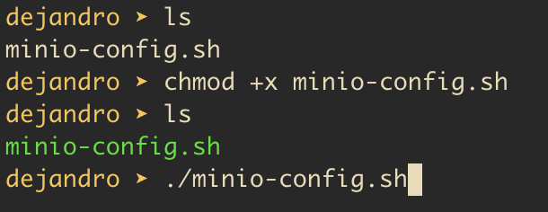

# linux-minio-client-config
This script installs the mc command line tool and creates the Alias for the MinIO instances

1. Make the script executable with the command
   chmod +x minio-config.sh
2. Edit the usernames.txt and add usernames
3. Run the script
   ./minio-config.sh
      
